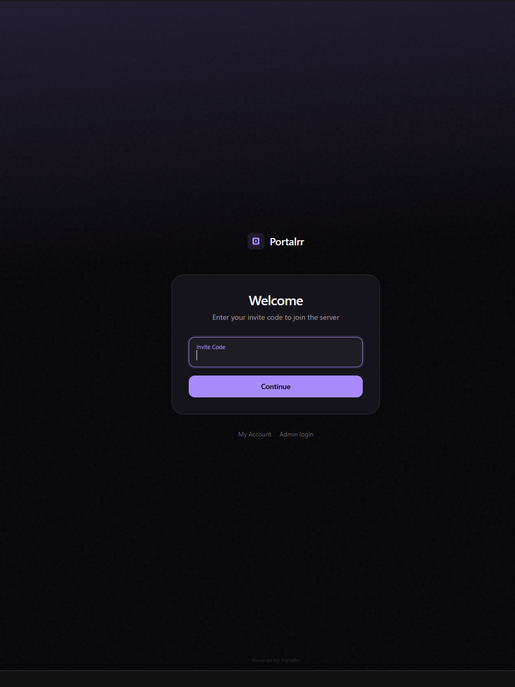
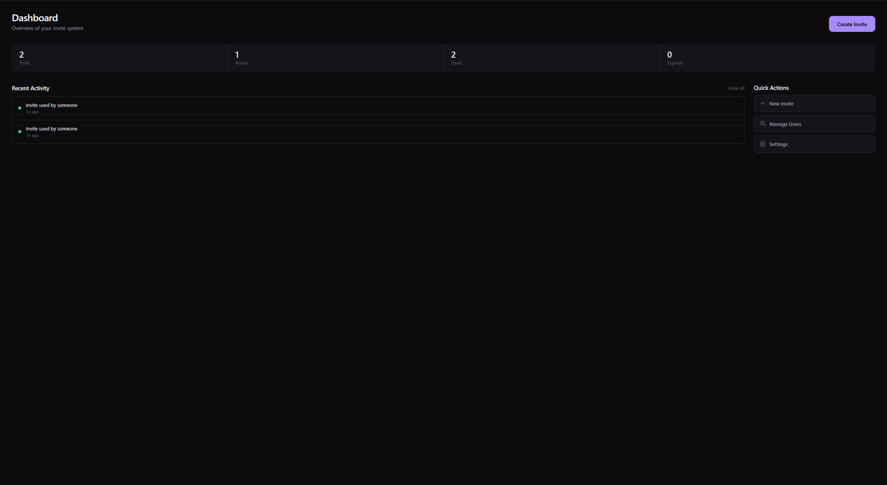
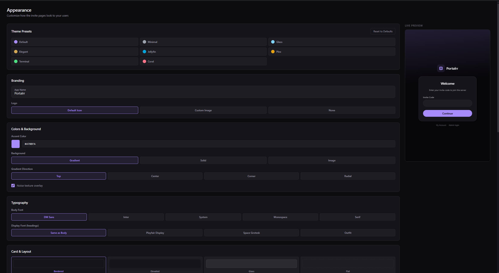
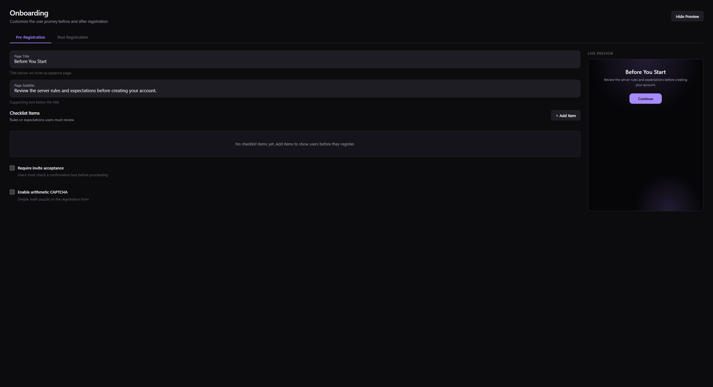

<p align="center">
  
</p>

<h1 align="center">Portalrr</h1>

<p align="center">
  <strong>The invite management portal you'll actually want to customize.</strong><br/>
  Self-hosted invite system for Plex and Jellyfin with 30+ theme options, block-based onboarding, and full branding control.
</p>

<p align="center">
  A modern alternative to <a href="https://github.com/wizarrrr/wizarr">Wizarr</a> and <a href="https://github.com/hrfee/jfa-go">JFA-GO</a>.
</p>

---

## Screenshots

| | |
|---|---|
|  |  |
|  |  |

---

## Features

### Invite System
- Generate codes with expiry, usage limits, and per-invite library controls
- Three code types: random, numeric PIN (easy to share verbally), or custom
- Labels, passphrase protection, and per-invite notification toggles
- Invite profiles — saved templates for quick creation
- Public invite request queue (users request access, admins approve/deny)
- Referral system — let users generate their own invite links

### Appearance & Branding
- **30+ theme options** — accent colors, fonts, card styles, backgrounds, animations, gradients, noise textures, custom CSS
- **One-click presets** — Default, Minimal, Glass, Elegant, Jellyfin, Plex, Terminal, Coral
- **Block-based onboarding editor** — build welcome pages with text, feature lists, app links, images, CTAs
- **Pre-registration flow** — checklist, acceptance rules, and CAPTCHA
- **Live preview** — see every change before your users do
- **Dynamic contrast** — text adapts automatically to light or dark accent colors

### Multi-Server Support
- Connect multiple Plex and Jellyfin servers
- Per-invite server targeting with library selection
- Per-user multi-server access management
- Encrypted credential storage (AES-256-GCM)
- Guided setup wizard — connect your first server in under a minute

### User Management
- View all users across connected servers with live sync
- Disable/enable accounts, admin notes, labels, contact methods (Discord, Telegram, Matrix)
- Bulk actions: delete, disable, enable, apply profile
- Import existing users from media server
- Auto-remove expired users on schedule
- User self-service portal (password change, email update, referrals)

### Notifications
- **Webhooks** — Discord embeds + generic JSON with HMAC-SHA256 signing (14 event types)
- **Email** — SMTP with customizable Markdown templates (6 types), variable substitution, live preview
- **Discord bot** — role assignment on registration, event notifications
- **Telegram bot** — event notifications
- **Announcements** — send to all users or filtered groups via email and bots

### Admin
- Multiple admin accounts with independent 2FA (TOTP)
- Media server admin login — Jellyfin admins and Plex owners can log in directly
- Comprehensive audit log with filtering
- Session management — view and revoke active sessions
- Backup and restore (selective JSON export/import)
- Account lockout after failed login attempts

### Integrations

| Service | Capabilities |
|---------|-------------|
| Jellyfin | User management, password sync, library control, activity streams, admin auto-detection |
| Plex | User management, library sharing, owner authentication |
| Jellyseerr / Overseerr | View, approve, and decline media requests from the admin panel |
| Discord | Bot with role assignment on registration and channel notifications |
| Telegram | Bot with event notifications to chats |

### Security
- Session-based auth with bcrypt (cost 12) and TOTP 2FA
- CSRF protection via Origin/Referer validation
- Rate limiting on all sensitive endpoints
- Zod validation on every API input
- AES-256-GCM encryption for secrets at rest
- Content Security Policy, HSTS, and security headers
- Anti-enumeration (constant-time responses, generic error messages)
- Configurable password rules and arithmetic CAPTCHA

---

## Quick Start

### Docker Compose (recommended)

```yaml
services:
  portalrr:
    image: portalrr/portalrr:latest
    container_name: portalrr
    restart: unless-stopped
    ports:
      - "3000:3000"
    volumes:
      - portalrr-data:/app/prisma/data
    environment:
      # Generate with: node -e "console.log(require('crypto').randomBytes(32).toString('hex'))"
      - ENCRYPTION_KEY=your-64-char-hex-key-here
      # Uncomment if accessing over plain HTTP (no reverse proxy with HTTPS)
      # - INSECURE_COOKIES=true

volumes:
  portalrr-data:
```

```bash
docker compose up -d
```

Open `http://localhost:3000` — the setup wizard walks you through creating your admin account and connecting your first server.

### Build from Source

```bash
git clone https://github.com/portalrr/portalrr.git
cd portalrr
cp .env.example .env
# Edit .env and set ENCRYPTION_KEY
npm install
npx prisma migrate deploy
npm run build
npm start
```

---

## Configuration

| Variable | Required | Default | Description |
|----------|----------|---------|-------------|
| `ENCRYPTION_KEY` | Yes | — | 64-char hex key for AES-256-GCM encryption. Generate with: `node -e "console.log(require('crypto').randomBytes(32).toString('hex'))"` |
| `DATABASE_URL` | No | `file:./data/portalrr.db` | SQLite database path |
| `PORT` | No | `3000` | Server port |
| `INSECURE_COOKIES` | No | `false` | Set to `true` for HTTP-only deployments (LAN without HTTPS) |

Everything else — servers, appearance, integrations, email, bots — is configured through the admin dashboard. No config files to maintain.

---

## Tech Stack

| Layer | Technology |
|-------|-----------|
| Framework | Next.js 16 (App Router, Turbopack) |
| Language | TypeScript |
| Database | SQLite via Prisma ORM |
| Styling | CSS Modules + CSS custom properties |
| Auth | Session-based, bcrypt, TOTP 2FA |
| Encryption | AES-256-GCM for secrets at rest |
| Testing | Vitest + React Testing Library |

---

## Development

```bash
git clone https://github.com/portalrr/portalrr.git
cd portalrr
cp .env.example .env
npm install
npx prisma migrate dev
npm run dev
```

The dev server runs at `http://localhost:3000` with hot reload via Turbopack.

```bash
npm test          # Run tests
npm run test:watch # Watch mode
npm run build      # Production build
```

---

## FAQ

See [FAQ.md](FAQ.md) for common questions about setup, configuration, customization, and troubleshooting.

## Contributing

Contributions are welcome. Please open an issue first to discuss what you'd like to change.

## License

[MIT](LICENSE)
